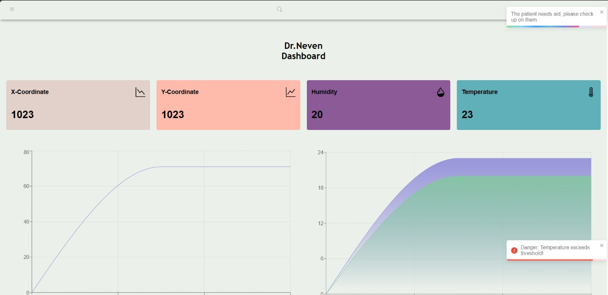
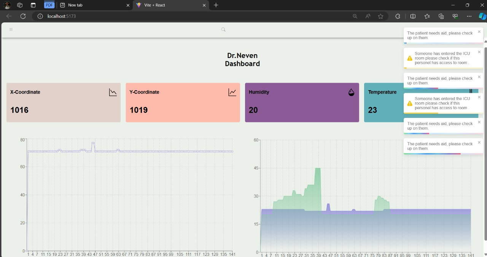

# Ulcer Paralysis Monitoring 
The Ulcer Paralysis Monitoring project utilizes sensors like FSR9, touch sensor, accelerometer, and pulse sensor to assist the patient in various ways. The FSR9 sensor is used to detect if the patient falls off the bed to prevent injuries. The touch sensor allows the patient to communicate his needs by touching a button that sends signals to healthcare providers. The accelerometer detects motion or wrong positions that could harm the patient, while the pulse sensor monitors the patient's heartbeats to aid healthcare providers in emergencies.

The materials required for the prototype of the Ulcer Paralysis Monitoring project include Arduino Uno, TTP226 Capacitive Touch Sensor, Accelerometer Sensors, Jumper wires, and a Breadboard.

We used ReactJS to create a website that has a demo for a nurse dashboard that provides the nurse with real-time data of the patient. The data are in the form of graphs or values that are represented in the boxes above, in addition; if certain parameters exceed the required threshold either a warning or a danger message appears on the dashboard to notify the nurse of any irregularities. The patient also can send message with certain requests to the nurse via the capacitive touch sensor to ask them to cater for their needs.

More information about interfacing FSR (Force Sensing Resistor) with Arduino can be found in the following references provided in the document:
- https://www.instructables.com/Force-Sensing-Resistor-FSR-Arduino-Simple-Tutorial/
- https://robosans.com/learn/embedded/arduino/interfacing-fsr-force-sensing-$PAGE_8

## Technologies Used in website
- ReactJS
- RECharts
- HTML
- CSS
- Toastify

## Team Members
|  Name |
| --- |
| Caroline Ehab |
| Hamza Elghonemy |
| Mohamed Abdelrazik |
| Moamen Ehab |

## Pictures From The Website

